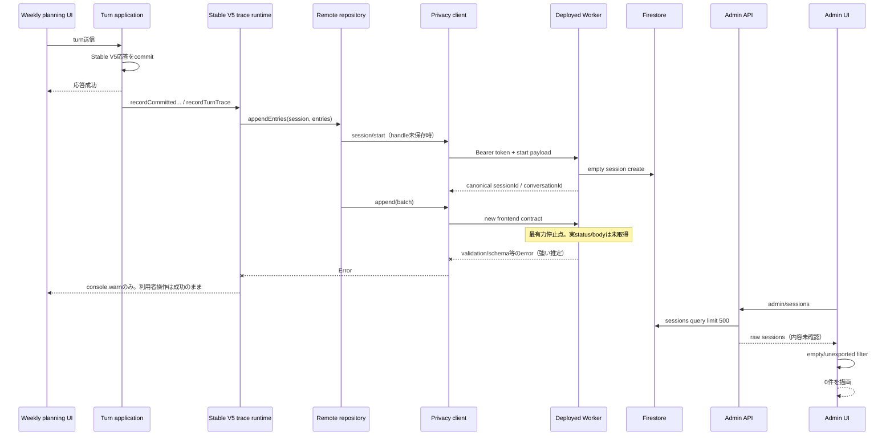

# PR #94後に週間計画traceが管理画面から消えた障害の実環境調査

調査日: 2026-07-28（Asia/Tokyo）
対象Issue: [#89](https://github.com/kame447/StudyPlannner/issues/89)
対象PR: [#94](https://github.com/kame447/StudyPlannner/pull/94)

## 結論

再現: **再現した。** ProductionでStable V5を2ターン実行し、1ターン目の完了時とreload後の2ターン目の完了時に、それぞれ `"[WeeklyPlanning Stable V5 Trace] write failed Object"` が発生した。利用者向け週間計画応答は成功した。管理画面は再読込後も0件だった。

ログが出ない直接原因: **traceのremote writeが失敗している一方、利用者操作は成功扱いとなり、管理画面は `hasUnexportedWeeklyPlanningTraceActivity()` をAPI取得直後に適用して空sessionを除外するため。** ただし、今回のブラウザ観測手段ではraw `/admin/sessions` bodyを取得できず、今回作成された空sessionが実際にraw APIへ含まれることまでは確認できていない。

根本原因: **未確定。** 実ブラウザでremote write失敗までは確認済みだが、失敗したrequestが `/session/start` か `/append` か、status/error bodyが何かを取得できていない。最有力は、PR #94のfrontendが送る新contractと、未更新のdeployed Workerとのversion skewによるappend validation失敗である。

PR #94による表示上の変化: **確認済み。** `turnCount === 0 && entryCount === 0` をactivityなしとして、admin API取得直後と描画前の2か所で除外するようになった。PR前に見えていた空sessionはPR後には見えない。

frontend / Worker version skew: **強い推定。** Production frontend bundleはPR #94相当のStable V5 event・dotted base64・remote trace設定を含む。一方、Workerのrevision/deploy時刻/対応commitはCloudflare OAuth失効により取得不能で、main merge時にWorkerをdeployするworkflowもない。PR前Worker sourceは `stable_v5_debug_stage` を受理しない。

session/start: **未確認。** Production routeとCORSは到達可能だが、今回の認証済み試行のstatus/body/sessionId/logicalConversationIdは取得できなかった。

append: **失敗確認済み、詳細未確認。** trace処理全体のwarningを各ターンで確認した。request回数、status、body、bytes、entries、sequenceは取得できなかった。

raw admin API: **body未確認。** 管理画面のrepository callはUI errorなしで完了したが、componentがraw配列をstateへ保持する前にfilterするため、raw件数と内容を観測できなかった。

UI filter: **確認済み。** `hasWeeklyPlanningTraceActivity()` は `turnCount > 0 || entryCount > 0` のみをactivityとする。`hasUnexportedWeeklyPlanningTraceActivity()` はactivityなしをfalseにし、取得直後と表示時に二重適用される。実描画は0件。

Firestore persistence: **未確認。** 実Firestore、Worker logs、raw admin responseへ直接アクセスできなかった。空session作成有無、entry document作成有無、metadata更新有無は確定していない。

修正着手可否: **まだ不可。** まずCloudflare認証を復旧し、deployed revisionとWorker logsを取得したうえで、認証済みCase 1〜5の最小contract probeを実行し、最初に失敗するrequestとerror bodyを確定する必要がある。今回、実装修正・deploy・commit・PR・Issue closeは行っていない。

## 原因の確度

### 確認済み

- `main`、`origin/main`、production調査baselineはいずれも `323d948de39500efcda8e1f5b29369cae8973fb1`。
- Production frontendは `https://studyplannner.pages.dev/`、接続先Workerは `https://studyplanner-ai-proxy.kame-website.workers.dev`。
- Production frontend bundleはtrace featureを有効化し、remote repositoryを構成する。
- ログイン済みuser `kame` でStable V5を選択し、2ターンとも週間計画応答が完了した。
- 2ターンともtrace write warningが発生した。
- reload後も同じ会話履歴が復元され、2ターン目を継続できた。
- 管理画面の週間計画ログは「0件」「条件に一致するsessionはありません」。再読込後も同じで、取得error表示はなかった。
- PR #94のempty-session filterはAPI取得直後と描画前に適用される。
- Worker URLのproduction originに対するCORS preflightは204。未認証policy requestは401。
- GitHub ActionsはWorker deployを行わない。

### 強い推定

- `/session/start` は成功し、`/append` が失敗して空sessionだけが残っている。PR #94前の症状、remote repositoryのstart→append順、PR #94後のUI filter、今回のwrite warningと0件表示が整合する。ただしraw API/Firestoreで未確認。
- deployed WorkerがPR #94より古く、`stable_v5_debug_stage` または新しいtransport/schemaを拒否している。frontendは新contract、PR前Worker sourceは新eventを知らず、Worker自動deployはなく、今回実環境でwriteが失敗した。
- frontendとWorkerは同じFirebase projectを狙っている。frontend bundle/local configは `study-planner-d1bc8` で一致するが、deployed Workerの実secret値は取得できていない。

### 未確認

- 認証済み `/session/start` と `/append` のstatus、response body、request body、request回数。
- canonical `sessionId`、`logicalConversationId`、local session ID、server handle、requestIds、nextSequence、nextTurnIndex。
- raw `/admin/sessions` のsession数、空sessionの有無。
- raw `/admin/entries` の結果。
- 実Firestoreのsession/entry document。
- deployed Workerのrevision、deploy時刻、対応commit、実allowlist、実Firestore project。
- Case 1〜5のどこが最初に失敗するか。

## 1. 調査対象main SHA

- branch: `main`
- HEAD: `323d948de39500efcda8e1f5b29369cae8973fb1`
- `origin/main`: 同一
- subject: `fix: Stable V5 trace空session重複を修正 (#94)`
- parent: `259c50b0becda18007f76709aa81b56db4997e97`
- worktree開始時: clean
- 分類: investigation / verification。実装branchやPRを作る段階ではない。

## 2. 実行環境

- 調査端末: Windows + WSL Ubuntu
- repository: `/home/kame/projects/studyplanner-app`
- browser: Codex in-app browser
- timezone: Asia/Tokyo
- production user: ログイン済み、表示名 `kame`
- production runtime: Stable V5
- local Windows Node: `20.20.2`
- local WSL Node: `12.22.9`。project verificationにはWindows Nodeを使用する。
- secrets/token/passwordは記録していない。

## 3. frontend URL

正しいproduction URLは次である。

```text
https://studyplannner.pages.dev/
```

`studyplannner` は `n` が3つである。`https://studyplanner.pages.dev/` は別サイトであり、今回の対象ではない。

観測したproduction asset:

```text
/assets/index-Bq-0y9UQ.js
ETag: "ea1ca3962d5fcc46eddda145ab63ebe2"
```

bundleには次が含まれる。

- production Worker URL
- `study-planner-d1bc8`
- `/weekly-planning-trace/session/start`
- `/weekly-planning-trace/append`
- `/weekly-planning-trace/admin/sessions`
- `stable_v5_debug_stage`
- `base64-utf8-json-dotted-20`
- feature flagがtrueとなるproduction code

commit SHAを表示するbuild metadataはないため、assetだけから完全に同一SHAとは証明できない。ただしPR #94のcontractを含むことは確認できた。

## 4. Worker URL

```text
https://studyplanner-ai-proxy.kame-website.workers.dev
```

production originからのpreflight:

```text
OPTIONS /weekly-planning-trace/session/start
status: 204
Access-Control-Allow-Origin: https://studyplannner.pages.dev
Access-Control-Allow-Headers: Authorization, Content-Type
X-StudyPlanner-Proxy-Version: weekly-planning-request-budget-20260723-001
```

未認証のpolicy request:

```text
GET /weekly-planning-trace/policy
status: 401
body: {"ok":false,"error":"ログイン情報を確認できませんでした。"}
```

routeとCORS middlewareまでは到達する。

## 5. Worker deploy revisionまたは確認不能理由

**確認不能。**

`wrangler deployments list` / `wrangler versions list` を実行したが、保存済みCloudflare OAuth refresh tokenがexpired/invalidで、`CLOUDFLARE_API_TOKEN` も未設定だった。このため次を取得できなかった。

- deploy timestamp
- deployment ID
- version ID
- revision
- source commit
- deployed bundleのevent allowlist

`X-StudyPlanner-Proxy-Version` はPR #94前後で同じ定数なので、revision識別子には使えない。

`.github/workflows/ci.yml` はtypecheck/test/buildだけで、Worker deploy stepを持たない。`main` mergeはWorker deployを意味しない。

## 6. 正確な再現手順

1. `https://studyplannner.pages.dev/` を開き、ログイン済みであることを確認。
2. アプリ設定で週間計画AIを `Stable V5` に切替。
3. 「日」→「新規追加」→「AI入力」→「週間計画」を開く。
4. `2026年8月3日からの1週間、数学を毎日30分勉強したい` を送信。
5. 利用者向け応答完了を待つ。
6. consoleでtrace warningを確認。
7. 同じURLをreload。
8. 同じ導線で週間計画を開き、1ターン目の履歴が復元されていることを確認。
9. `数学の問題集を合計3時間、8月3日からの週に進めたい` を送信。
10. 2ターン目の応答完了と2件目のtrace warningを確認。
11. マイページ→管理者画面→週間計画ログを開く。
12. 「再読込」を押し、0件とerror表示なしを確認。

今回は予定の一括承認・保存を行っていない。ユーザーから実験用アカウントとして予定作成・削除の許可は得たが、turn trace再現には不要だった。

## 7. Browser Network結果

in-app browserが提供する診断APIはconsole log取得までで、HAR/request/response body取得APIを持たなかった。認証情報をlocalStorage/cookieから抽出する方法は使用していない。

取得できた実ブラウザ証拠:

| 時刻 (UTC) | 操作 | UI結果 | console |
|---|---|---|---|
| 2026-07-28 11:43:31.889 | 1ターン目完了 | app response成功 | `[WeeklyPlanning Stable V5 Trace] write failed Object` |
| 2026-07-28 11:44:59.893 | reload後の2ターン目完了 | app response成功 | 同じwarning |

consoleはobject引数を展開せず `Object` とrenderするため、内部のerror stringは取得できなかった。

## 8. `/session/start` の結果

| 項目 | 結果 |
|---|---|
| production route/CORS | 確認済み、204 |
| 実アプリ試行で呼ばれたか | 未確認 |
| status | 未確認 |
| response body | 未確認 |
| sessionId | 未確認 |
| logicalConversationId | 未確認 |

sourceではremote repositoryが最初に `client.startSession()` を呼び、server handle取得後にcanonical payloadを作る。startは `turnCount: 0, entryCount: 0` のsession documentを先にimmutable createする。

## 9. `/append` の結果

| 項目 | 結果 |
|---|---|
| trace remote write | 各ターンで失敗warning |
| append自体が呼ばれたか | 強い推定、直接未確認 |
| request回数 | 未確認。source上は一般errorで同一batchを1回retryする |
| status/body | 未確認 |
| bytes/entries/sequence | 未確認 |
| session.entryCount/turnCount | 未確認 |
| eventType | runtime source上は `stable_v5_debug_stage` を含み得る。実request一覧は未確認 |

`appendCanonicalBatches()` はserver-handle rejection以外のerrorで同一batchをもう1回送る。Workerのentry writeはentryごとのimmutable write後にsession metadataを更新するため、transactionではない。

## 10. raw `/admin/sessions` の結果

**raw bodyは未確認。**

管理画面のloadはUI errorを出さず完了したため、repository callが正常に配列を返したことまでは確認できる。しかしcomponentは返却直後に `hasUnexportedWeeklyPlanningTraceActivity` を適用し、raw配列を別stateへ保持しない。

したがって次のどちらかを今回のUIだけでは区別できない。

1. raw APIに空sessionがあり、UI filter後に0件。
2. raw API自体が0件。

Hypothesis Aを確定するにはraw bodyかFirestore documentが必要である。

## 11. raw `/admin/entries` の結果

**未実行・未確認。**

表示sessionが0件だったため、sessionを展開して `/admin/entries` を呼ぶ導線がなかった。raw session IDも取得できていない。

またserver側のcurrent-layout entry recoveryはsessionの `entryCount` を上限として読む。entry documentだけ部分的に作られ、session metadataが0のままなら、entryが存在してもadmin entriesから回収できない可能性がある。

## 12. UI filter前後の件数

| 段階 | 件数 | 確度 |
|---|---:|---|
| raw `/admin/sessions` response | 不明 | 未確認 |
| `sessionFromRemote()` 後 | 不明 | 未確認 |
| `hasWeeklyPlanningTraceActivity()` 後 | 不明 | 未確認 |
| `hasUnexportedWeeklyPlanningTraceActivity()` 後 | 0 | UI state/描画から確認 |
| user/status/date/error等filter後 | 0 | 確認済み |
| 実描画 | 0 | 確認済み |

該当実装:

- `weeklyPlanningTraceArchive.ts:8-17`
- `WeeklyPlanningTraceDebugPage.tsx:119-124`
- `WeeklyPlanningTraceDebugPage.tsx:216-218`

API取得直後と描画前に同じfilterが二重適用される。

## 13. FirestoreまたはWorker logの証拠

実FirestoreとWorker tail logsは取得できなかった。

確認できた代替証拠:

- production frontendの2回のtrace write warning
- admin loadはerror表示なしで0件
- Worker public route/CORS/401 response
- source上、startが空session documentを先に作り、appendがentryとmetadataを後から書く
- source上、Worker appendはentry immutable write後にsession metadataを更新する非transaction構成

未確認のdocument項目:

- `weekly_planning_trace_sessions`
- `weekly_planning_trace_entries`
- `entryCount`
- `turnCount`
- `lastActivityAt`
- `traceSubjectToken`
- `logicalConversationId`
- `sessionId`
- `expireAt`

## 14. End-to-end sequence diagram



確認済み停止境界は「trace runtimeからremote writeが完了するまでのどこか」である。`/append` を停止点として描いた部分は強い推定で、Worker logs/raw responseによる確定が必要。

## 15. 七視点ごとの判定

### 視点1: End-to-end architecture

判定: **利用者turnとtrace persistenceが非同期・非致命に分離されており、利用者成功はpersistence成功を保証しない。**

- production entrypointは `weeklyPlanningTurnSideEffects.ts` から `recordWeeklyPlanningStableV5TurnTrace()` へ接続されている。
- 実productionのwarningにより、このentrypointが実際に呼ばれたことも確認した。
- remote pathは startとappendを分離するため、空sessionが残り得る。
- admin UIが空sessionを隠すため、persistence失敗が「ログなし」に変換される。

### 視点2: Deployment/configuration/version skew

判定: **version skewが最有力だが未確定。**

- production frontend: PR #94 contractあり、feature true、remote Worker URLあり。
- Worker deploy revision: Cloudflare認証失効で確認不能。
- Worker route: `workers.dev` URL、production origin CORS許可。
- GitHub CI: Worker deployなし。
- Firebase frontend project: `study-planner-d1bc8`。
- Worker source configも同projectを想定するが、deployed secretは未確認。
- admin viewerは同production Worker URLを使う。

環境差:

| 環境 | flag未設定時 | repository |
|---|---|---|
| Vite dev | feature resolverはtrue、ただしconfigureはearly return | direct Firestore/local |
| local production build/preview | feature resolverはfalse | noop |
| production Pages | compiled flag true | remote Worker |

加えてWorker CORSは `https://localhost:4173` を許可し、`http://localhost:4173` は拒否する。local successはproduction remote pathの証明にならない。

### 視点3: Schema/transport

判定: **frontend/source Worker contractはmain上で共有化されたが、deployed Worker適用は未確認。**

main contract:

- event allowlistに `stable_v5_debug_stage`
- max request: 512 KiB
- max entries/request: 100
- max document: 64 KiB
- client document target: 48 KiB
- client batch target: 384 KiB
- debug raw chunk: 2700 bytes
- encoding: `base64-utf8-json-dotted-20`
- dotted run width: 20

PR #94 parentのWorker privacy sourceには `stable_v5_debug_stage` がない。frontend新/Worker旧なら小さいdebug eventでもvalidation failureになり得る。

### 視点4: Identity/idempotency/atomicity

判定: **設計上のcontinuityはあるが、実値は観測不能。appendはatomicではない。**

- local session IDからserver-issued canonical IDsを取得する。
- server handleをlocalStorageへ保存しreload後に再利用する。
- reload後に同じ会話履歴が復元され、2ターン目の処理は継続した。
- local cursorはremote append成功後にのみcommitされる。
- general append errorは同一batchを1回retryする。
- Workerはentriesを順次immutable writeし、その後session metadataを更新する。
- partial batch、immutable conflict、metadata更新失敗時の回復性に穴がある。

browser security ruleに従いlocalStorage/session/cookieを直接読んでいないため、handle/cursor/requestIdの実値は未確認。

### 視点5: Admin UX/visibility

判定: **empty-session filterが障害を隠す。**

- raw APIとfiltered UIを観測可能なstateに分離していない。
- load時に即filterし、さらにrender前にもfilterする。
- empty sessionは表示されない。
- archive判定は `lastActivityAt > archivedAt` のとき再表示する。
- serverはorderなし、limit 500でqueryし、clientが返却subsetだけをsortする。
- mapping必須field欠落sessionはactivity filter前にdropされる。
- error noticeとempty-stateの両方をrender可能で、API失敗と正常0件が視覚的に混同され得る。
- 今回はerrorなしの0件だった。

### 視点6: Observability/error handling

判定: **根本原因を確定できない主要因。**

- `recordWeeklyPlanningStableV5TurnTrace()` はerrorをcatchしてwarningだけにする。
- consoleのerror objectは今回のbrowser logでは展開されなかった。
- clientはWorker error文字列をError messageとして残すが、status codeは保持しない。
- correlation IDをresponse/logへ通すcontractがない。
- session start成功とappend失敗を一目で区別できない。
- admin UIはraw count、mapped count、activity filtered countを表示しない。
- Worker logへrequest/session/sequenceを安全に相関するIDがない。

### 視点7: Tests/verification/merge hygiene

判定: **green testsはdeployed pathを検証していない。さらにmerge後CI自体もgreenではない。**

- `weeklyPlanningTraceStableV5Debug.integration.test.ts` はfake/in-memory Firestore clientでhandlerを直接呼ぶ。
- `weeklyPlanningStableV5TraceRemoteContinuity.integration.test.ts` はfake clientとin-memory storage。
- real Firebase Auth、CORS、deployed Worker、real Firestore、Pages envを通らない。
- deployed contract test、frontend新/Worker旧 skew test、real browser/network testがない。
- CI run [30343474645](https://github.com/kame447/StudyPlannner/actions/runs/30343474645) はfailure。`verify` jobはstepsが0件で2秒終了しており、code assertion failureではなくrunner/infrastructure側の失敗とみられる。
- Issue #89はOPEN。PR #94 head branch `agent/trace-empty-session-seven-audit` はremoteに残っている。

## 16. 確定原因

確定している原因は次の組合せである。

1. production Stable V5のtrace remote writeが各turnで失敗している。
2. failureは利用者操作へ伝播せずconsole warningだけになる。
3. admin UIは空sessionをactivityなしとして取得直後に除外する。
4. そのため、PR前に空sessionとして見えた障害が、PR後には「ログ0件」に見える。

ただしremote write失敗のさらに内側、すなわちstart/auth/append/schema/Firestoreのどこが根本停止点かは未確定である。

## 17. 強い推定

最有力の因果列:

```text
PR #94相当frontend
→ /session/start成功
→ empty session作成
→ PR #94未適用Workerへstable_v5_debug_stage等をappend
→ Worker validation失敗
→ frontendはwarningだけ
→ raw adminにはempty session
→ PR #94 UI filterで0件
```

根拠:

- PR前は同logical conversationのempty sessionが複数見えていた。
- current sourceもstartでempty sessionを先に作る。
- PR #94でfrontendとWorker双方のcontractが変わった。
- Worker deployはmerge workflowに含まれない。
- deployed revisionを証明できない。
- PR前Worker sourceは新eventを受け付けない。
- productionで2回ともtrace writeが失敗した。

反証可能性:

- `/session/start` 自体が412/400/500で失敗している可能性。
- deployed Workerは新しく、別のschema/Firestore errorでappendが失敗している可能性。
- raw APIにempty sessionがなく、enable/auth/start段階で止まっている可能性。

## 18. 未確認事項

実装前に次を埋める。

1. Cloudflare認証を復旧しdeployments/versionsを取得。
2. `wrangler tail` で今回または新規probeのrequestを観測。
3. 認証済みCase 1〜5を実行。
4. raw `/admin/sessions` bodyを保存。
5. empty sessionがあればraw `/admin/entries` を実行。
6. Firestore session/entry documentを照合。
7. startとappendのstatus/body/bytes/entry types/sequenceをHARで取得。
8. deployed Worker envのFirebase projectを安全に照合。

## 19. PR #94が改善した点

- shared event catalogを導入し、source frontend/Worker間のallowlist driftを減らした。
- `stable_v5_debug_stage` を正式contractへ追加した。
- dotted base64でtoken redactionとの衝突を避ける設計を追加した。
- document/request/entry上限とclient-side batchingを明文化した。
- server-issued canonical session/conversation IDとserver handle continuityを導入した。
- same logical conversationの重複empty session作成を抑制する方向へ進めた。
- empty sessionを通常の未export活動一覧から除外した。
- fake環境では新debug eventの保存・admin取得までの回帰testを追加した。

## 20. PR #94が悪化または隠蔽した点

- empty sessionを管理画面から完全に隠したため、append障害の主要な手掛かりが消えた。
- raw、mapping後、activity後、archive後、render後の件数を分けて表示しない。
- source contractを同時変更したのにWorker deployをmerge gateへ含めなかった。
- proxy version headerを更新しなかったため、deployed revision判定に使えない。
- retryがgeneral errorで同一appendを再送するため、validation errorでも無意味な再送を行い得る。
- partial entry write後のmetadata failureをadmin UIから発見しにくい。

## 21. 影響範囲

- Production Stable V5のturn trace全般。
- reload前後の同一conversation continuity。
- debug-stageを含むturn。
- 管理者の障害調査、品質監査、export対象把握。
- empty session、partial entry、malformed sessionの可視性。
- trace失敗を利用者成功から推測できない運用。

学習予定そのものの作成・会話応答は継続するため、利用者は障害に気付きにくい。trace privacy deletion/archiveを今回変更・実行していない。

## 22. 最小修正案

根本error確定後の最小release unit:

1. deployed Workerをfrontendと同じshared contractを含むrevisionへdeployする。
2. deploy後にCase 1〜5とproduction browser 2-turn/reload testを実行する。
3. admin UIに「raw取得数 / mapping後 / activity後」の診断summaryをadmin限定で表示する。
4. empty sessionを通常一覧から除外したままでも、別のdiagnostic countまたは「empty session N件」を表示する。
5. trace warningへ安全なstage、HTTP status、error category、correlation IDを含める。

error bodyがversion skew以外を示した場合は、推定に基づいてWorker deployだけを行わず、そのerrorに限定した修正へ切り替える。

## 23. 抜本修正案

- frontend/Worker共通のcontract versionをrequest/response/headerへ明示する。
- Worker起動bundleへcommit SHAまたはbuild revisionを埋め込み、health endpointで安全に返す。
- Worker deployをrelease workflowの明示的gateにする。
- start+first appendを単一API/transaction相当へまとめ、empty sessionを通常failure artifactにしない。
- append batchをFirestore transaction/batch writeまたはrecoverable journalにする。
- session metadataではなくentry queryからreconciliationできる管理repair/read pathを持つ。
- request correlation ID、session ID、sequence range、event summary、result categoryをstructured logに残す。
- admin UIにraw/mapped/filtered/error/empty/partialを別stateで表示する。
- deployed Worker contract suiteを本番と同じbundleに対してrelease前後に実行する。

## 24. 必要なunit test

- feature resolverとruntime resolverのunset時挙動を同じcontractにするtest。
- `sessionFromRemote()` がdropする各必須fieldのdiagnostic test。
- raw/mapped/activity/unexported countsのselector test。
- empty sessionを非表示にしてもdiagnostic countが残るtest。
- API errorと正常0件のUI state分離test。
- HTTP status/error category/correlation ID保持test。
- general validation errorをretryしないtest。
- partial batch cursorをcommitしないtest。
- contract version mismatchの明示error test。

## 25. 必要なintegration test

- frontend remote repository + real Worker handler bundle + Firestore emulator。
- start成功、append失敗時にempty sessionとerror diagnosticを確認。
- first entry write後、session metadata更新失敗を注入しrecoveryを確認。
- immutable conflict/retry/idempotency。
- reload後のserver handle再利用とsequence continuity。
- archive後に新turnが追記された場合の再表示。
- 500件超、order、malformed document、entryCount不整合。
- Firebase Auth emulatorでpolicy未同意/期限切れtoken/role不足。

## 26. 必要なbrowser test

- production-equivalent previewでStable V5 1ターン。
- Networkでstart/append status、body、bytes、entries、sequenceをassert。
- reload後2ターン目でstart回数とhandle continuityをassert。
- adminでraw count、activity count、render countをassert。
- append失敗時に「0件」だけでなくdiagnostic stateが見えること。
- API 500と正常0件の表示差。
- feature flag unset/true/false、policy accepted/unaccepted、authあり/なし。
- `http://localhost:4173` とproduction-equivalent HTTPS/CORSの差を明示する。

## 27. 必要なdeployed Worker contract test

同一の認証済みtest subjectで順に実行し、各responseとFirestore結果を保存する。

1. Case 1: `/session/start`、entries 0。
2. Case 2: 小さい `user_turn_received` 1件。
3. Case 3: 小さい `stable_v5_debug_stage`、`storage=inline_json`。
4. Case 4: `storage=base64_utf8_json_chunk`、`encoding=base64-utf8-json-dotted-20`。
5. Case 5: 実アプリが生成する全entries/batches。
6. reload相当として同handleへ次sequenceをappend。
7. raw admin sessions/entriesでcanonical IDs、counts、sequence、event typesを照合。
8. contract versionとdeployed revisionをtest artifactへ記録。

最初に失敗したCaseで止め、status/error body/Worker log/Firestoreを揃える。

## 28. Worker deploy手順

これは手順案であり、今回実行していない。

1. Cloudflare OAuthを再認証するか、最小権限の`CLOUDFLARE_API_TOKEN`を設定。
2. `main` SHA、worktree、diff、Issue #89を再確認。
3. typecheck/test/buildとlocal Worker contract suiteを実行。
4. 現在のdeployment/version IDを記録。
5. `npm run deploy:worker` を実行。
6. `npx wrangler deployments list --config workers/ai-proxy/wrangler.jsonc` で新versionを記録。
7. CORS/health、Case 1〜5、browser reload test、raw admin、Firestoreを検証。
8. Issue #89へrevision、実測結果、rollback targetを記録。

参考: [Cloudflare Workers Versions & Deployments](https://developers.cloudflare.com/workers/versions-and-deployments/)、[Wrangler commands](https://developers.cloudflare.com/workers/wrangler/commands/workers/)

## 29. Worker rollback手順

これは手順案であり、今回実行していない。

1. deploy前に記録した直前のknown-good version IDを選ぶ。
2. `npx wrangler rollback <VERSION_ID> --config workers/ai-proxy/wrangler.jsonc` を実行。
3. deployments listでrollback反映を確認。
4. production originのCORS、policy、既存AI proxy機能をsmoke test。
5. trace Case 1を実行し、悪化を止めたことを確認。
6. Issue #89へrollback理由、version、時刻、残課題を記録。

rollbackでfrontend/Worker skewが再発する場合は、Pages側もcompatible versionへ戻す必要がある。Pages rollbackは[Cloudflare Pages rollbacks](https://developers.cloudflare.com/pages/configuration/rollbacks/)を参照する。

## 30. Issue #89を継続openにすべき理由

- productionでtrace write failureを再現した。
- adminは0件のまま。
- raw API/Firestore/Worker logsが未確認。
- deployed Worker revisionが未確認。
- Case 1〜5を実行していない。
- root failure stage/status/errorが未確定。
- merge後CI runもfailure。

したがって[#89](https://github.com/kame447/StudyPlannner/issues/89)は継続OPENが妥当である。今回close/updateは行っていない。

## 31. 誤ってclosedへ移したtask mdがあるか

`docs/ai/tasks/closed/20260727-weekly-planning-trace-empty-session-recovery.md` は「local automation完了」と「production verification未完了」を同時に記している。実production障害が残っているため、**タスク名が意味するend-to-end recovery完了としてclosed扱いするのは誤解を招く。**

推奨:

- historical記録としてファイルを自動移動・削除しない。
- Issue #89をcanonical active trackerとして維持する。
- 次のdocs更新時にclosed task冒頭へ「production verification failed / Issue #89で継続」を明記する。
- 新しい実装taskを乱立させず、同じlogical taskをIssue #89で継続する。

## 32. 次の実装担当へ渡す具体的なファイル単位指示

まず調査instrumentationを実装し、root error確定後にfixする。

- `src/features/weeklyPlanning/trace/weeklyPlanningTracePrivacyClient.ts`
  - status、error category、correlation ID、endpoint stageを保持するtyped errorを追加。
- `src/features/weeklyPlanning/trace/weeklyPlanningTraceRemoteRepository.ts`
  - start/append stageとbatch metadataを安全に観測可能にする。
  - retry対象をtransport/retriable errorへ限定。
- `src/features/weeklyPlanning/trace/weeklyPlanningStableV5TraceRuntime.ts`
  - warningへsafe stage/status/category/correlation IDを出す。
  - 利用者操作を壊さない方針は維持しつつ、運用監視へ通知する。
- `src/features/weeklyPlanning/trace/WeeklyPlanningTraceDebugPage.tsx`
  - raw/mapped/activity/unexported/rendered countsを分離。
  - API errorと正常0件を排他的に表示。
  - empty/partial diagnostic viewをadmin限定で追加。
- `src/features/weeklyPlanning/trace/weeklyPlanningTraceArchive.ts`
  - 通常一覧のactivity判定とdiagnostic visibilityを別概念にする。
- `src/features/weeklyPlanning/trace/configureWeeklyPlanningTraceRepository.ts`
  - feature resolverとruntime resolverのunset挙動を統一。
- `src/features/weeklyPlanning/trace/weeklyPlanningTraceRepository.ts`
  - `isWeeklyPlanningTraceEnabled()` とのgate二重定義を解消。
- `shared/weeklyPlanningTraceContract.ts`
  - explicit contract versionとerror envelopeを追加。
- `workers/ai-proxy/src/weeklyPlanningTraceApi.ts`
  - correlation ID、contract mismatch 409/426相当の明示response。
  - start/appendのstructured logs。
  - partial write recoveryまたはtransaction/batch化。
- `workers/ai-proxy/src/weeklyPlanningTracePrivacy.ts`
  - deployed contract testが共有allowlist/encoding/redactionを検証するよう維持。
- `.github/workflows/`
  - Worker deployそのものを無条件自動化せず、deploy revision記録とdeployed contract verificationをrelease gateへ追加。
- `workers/ai-proxy/wrangler.jsonc`
  - environment/project/routeを明示し、preview/productionを混同しない。

一時instrumentationを追加した場合:

- raw payloadやtokenを出すものは削除する。
- safe stage/status/category/correlation ID、raw/mapped/filtered countsは正式observabilityとして残す。
- production behaviorを変えるinstrumentationはroot cause確定前にmerge/deployしない。

## GitHub pre-flight / hygiene

- 既存Issue: #89を再利用。新規Issueなし。
- branch: `main` をread-only調査。新規branchなし。
- PR: #94を参照。新規PRなし。
- commit/push: なし。
- remote PR #94 head branch `agent/trace-empty-session-seven-audit` はmerge済みのため、Issue #89の追跡情報を保ったうえで削除候補。
- remaining workは別PRを作る前にIssue #89へ集約する。

## 今回追加した診断コード

production/local sourceへの診断コード追加なし。作成したのは本報告Markdownのみ。
