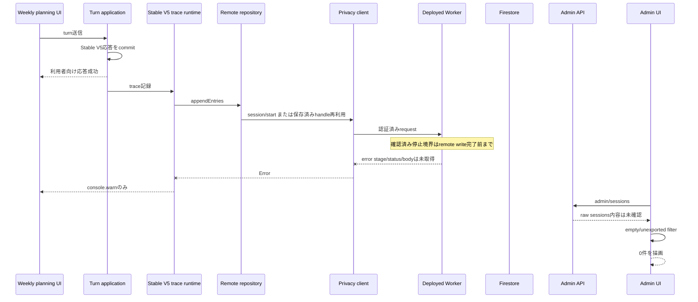

# PR #94後に週間計画traceが管理画面から消えた障害の実環境調査

調査日: 2026-07-28（Asia/Tokyo）

対象Issue: [#89](https://github.com/kame447/StudyPlannner/issues/89)

対象PR: [#94](https://github.com/kame447/StudyPlannner/pull/94)

## 0. 結論

ProductionのStable V5で、初回turnとreload後の2回目turnの双方において、利用者向け応答は正常に完了した一方、consoleへ `[WeeklyPlanning Stable V5 Trace] write failed Object` が出力された。管理画面は再読込後も0件だった。したがって、Productionのtrace remote write経路で障害が継続していることは確認できた。

ただし、今回確認できたwarningは、`/session/start`、`/append`、認証、schema validation、Firestore writeを含むremote write処理全体を囲むcatchから出力される。よって、`/append` が失敗したこと自体は確認済みではない。確認できた停止境界は、Stable V5 trace runtimeからremote writeが正常完了するまでのどこかである。

PR #94で追加されたempty-session filterが、`turnCount === 0 && entryCount === 0` のsessionを通常一覧から除外することは確認済みである。一方、今回のraw `/admin/sessions` responseは取得できていないため、今回実際に空sessionが返されてfilterで消えたのか、raw API自体が0件だったのかは区別できない。したがって、filterが今回の0件表示の直接原因であることは強い推定に留める。

根本停止点は未確定である。最有力仮説は、PR #94相当のfrontendと、PR #94のcontractを含まないdeployed Workerとのversion skewである。ただし、Cloudflare認証失効によりdeployed Worker revision、append response、Worker logs、Firestore documentを取得できなかったため、仮説を確定原因として扱わない。

Issue #89は継続OPENが妥当である。実装修正、Worker deploy、Issue closeは、最初に失敗するrequestとerror responseを確定するまで行うべきではない。

## 1. 確度別の整理

### 1.1 確認済み

Production frontendでStable V5を2turn実行し、双方で利用者向け応答が完了した。

双方のturn完了後にtrace write warningが発生した。

reload後も会話履歴が復元され、2turn目を同じ会話の続きとして実行できた。

管理画面はerror表示なしで0件を描画し、再読込後も変化しなかった。

PR #94の実装では、empty sessionをactivityなしと判定し、admin API取得直後と描画前の2か所で除外する。

Production frontend bundleはremote trace repository、`stable_v5_debug_stage`、`base64-utf8-json-dotted-20`を含む。

Production Worker URLは到達可能であり、production originからのCORS preflightは204、未認証policy requestは401だった。

GitHub ActionsのCI workflowにはWorker deploy stepがない。mainへのmergeだけではWorker deployは保証されない。

### 1.2 強い推定

`/session/start` は成功し、その後の`/append`が失敗している可能性が高い。source上はstart後にappendする構造であり、PR #94以前に空sessionが観測されていた症状とも整合する。ただし、今回のstart status、append status、raw session、Firestore documentを取得していないため未確定である。

deployed WorkerがPR #94より古く、`stable_v5_debug_stage`または新しいtransport contractを拒否している可能性が高い。frontendには新contractが含まれ、PR #94以前のWorker sourceは同eventを受理せず、merge workflowにもWorker deployがない。ただし、deployed revisionは未取得である。

raw admin APIに空sessionが存在し、PR #94のUI filterで0件に見えている可能性が高い。ただし、raw API自体が0件だった可能性を排除できない。

frontendとWorkerは同じFirebase projectを狙っている可能性が高い。frontend bundleとlocal configは`study-planner-d1bc8`で一致するが、deployed Workerのsecret値は未確認である。

### 1.3 未確認

認証済み`/session/start`の実行有無、status、response body、canonical session ID、logical conversation ID。

認証済み`/append`の実行有無、request回数、status、response body、request bytes、entries、sequence。

raw `/admin/sessions` responseの件数と内容。

raw `/admin/entries` response。

Firestore上のsession document、entry document、entryCount、turnCount、lastActivityAt。

deployed Workerのrevision、deploy時刻、対応commit、event allowlist、Firebase project。

最初に失敗するcontract probeのCase番号。

## 2. 調査baseline

調査時のmain、origin/main、production調査baselineは次のcommitだった。

```text
323d948de39500efcda8e1f5b29369cae8973fb1
fix: Stable V5 trace空session重複を修正 (#94)
```

調査開始時のworktreeはcleanだった。分類はinvestigation / verificationであり、実装修正を行う段階ではなかった。

## 3. 実行環境

調査端末はWindowsとWSL Ubuntuである。repositoryは`/home/kame/projects/studyplanner-app`、browserはCodex in-app browser、timezoneはAsia/Tokyoである。

Production userはログイン済みの`kame`、週間計画runtimeはStable V5である。

local Windows Nodeは`20.20.2`、WSL Nodeは`12.22.9`だった。project verificationにはWindows Nodeを使用した。

secret、token、passwordは記録していない。

## 4. Production frontend

対象URLは次である。

```text
https://studyplannner.pages.dev/
```

`studyplannner`は`n`が3つである。`https://studyplanner.pages.dev/`は別サイトであり、今回の対象ではない。

観測したassetは次である。

```text
/assets/index-Bq-0y9UQ.js
ETag: "ea1ca3962d5fcc46eddda145ab63ebe2"
```

bundleにはproduction Worker URL、`study-planner-d1bc8`、trace start/append/admin endpoints、`stable_v5_debug_stage`、`base64-utf8-json-dotted-20`、productionでtrueとなるfeature flagが含まれていた。

assetからcommit SHAを直接証明するbuild metadataはない。そのためProduction frontendが完全に`323d948`と同一であるとは断定しないが、PR #94のtrace contractを含むことは確認できた。

## 5. Production Worker

対象URLは次である。

```text
https://studyplanner-ai-proxy.kame-website.workers.dev
```

production originからのpreflight結果は次である。

```text
OPTIONS /weekly-planning-trace/session/start
status: 204
Access-Control-Allow-Origin: https://studyplannner.pages.dev
Access-Control-Allow-Headers: Authorization, Content-Type
X-StudyPlanner-Proxy-Version: weekly-planning-request-budget-20260723-001
```

未認証policy requestは次の結果だった。

```text
GET /weekly-planning-trace/policy
status: 401
body: {"ok":false,"error":"ログイン情報を確認できませんでした。"}
```

したがって、routeとCORS middlewareへの到達は確認できた。ただし、認証済みtrace requestの結果は確認できていない。

`wrangler deployments list`と`wrangler versions list`は、保存済みCloudflare OAuth refresh tokenがexpiredまたはinvalidであり、`CLOUDFLARE_API_TOKEN`も未設定だったため実行できなかった。

このため、deploy timestamp、deployment ID、version ID、revision、source commit、deployed bundleのevent allowlistは取得できなかった。

`X-StudyPlanner-Proxy-Version`はPR #94前後で同じ定数であるため、revision識別子として使用できない。

## 6. 再現手順

Production URLへログイン済みでアクセスし、週間計画AIをStable V5へ切り替えた。

「日」から「新規追加」、「AI入力」、「週間計画」を開き、次を送信した。

```text
2026年8月3日からの1週間、数学を毎日30分勉強したい
```

利用者向け応答完了後、consoleでtrace write warningを確認した。

同じURLをreloadし、1turn目の会話履歴が復元されていることを確認した後、次を送信した。

```text
数学の問題集を合計3時間、8月3日からの週に進めたい
```

2turn目の利用者向け応答完了後、再びtrace write warningを確認した。

その後、マイページから管理者画面の週間計画ログを開き、「再読込」を実行した。画面は0件であり、error表示はなかった。

予定の一括承認や保存は実行していない。turn trace再現には不要だった。

## 7. Browser観測結果

取得できた実ブラウザ証拠は次である。

| 時刻 UTC | 操作 | UI結果 | console |
|---|---|---|---|
| 2026-07-28 11:43:31.889 | 1turn目完了 | app response成功 | `[WeeklyPlanning Stable V5 Trace] write failed Object` |
| 2026-07-28 11:44:59.893 | reload後の2turn目完了 | app response成功 | 同じwarning |

in-app browserの診断APIはconsole log取得までであり、HAR、request body、response bodyを取得できなかった。consoleもobject引数を展開せず`Object`とrenderしたため、内部error stringは取得できなかった。

localStorage、cookie、sessionから認証情報を抽出する方法は使用していない。

## 8. session/startの判定

Production routeとCORSへの到達は確認したが、実アプリ試行で`/session/start`が呼ばれたか、status、response body、sessionId、logicalConversationIdは未確認である。

source上、remote repositoryはserver handleがない場合に最初に`client.startSession()`を呼び、handle取得後にcanonical payloadを作る。Worker sourceはstart時に`turnCount: 0`、`entryCount: 0`のsession documentを先に作成する。

このsource構造は、start成功後にappendが失敗した場合に空sessionが残る可能性を示す。しかし、今回その経路を通ったことの証明ではない。

## 9. appendの判定

trace remote write全体の失敗warningは各turnで確認した。

一方、append自体が呼ばれたかは直接確認できていない。request回数、status、body、bytes、entries、sequence、session countsも未確認である。

source上、`appendCanonicalBatches()`はserver-handle rejection以外のerrorで同一batchを1回再送する。Worker appendはentryを順番にimmutable writeした後、session metadataを更新する非transaction構成である。

したがって、validation errorへの無意味なretry、entryだけが部分的に保存される状態、metadata更新失敗が発生する余地がある。ただし、今回それらが発生したことは未確認である。

## 10. Admin APIとUI filter

raw `/admin/sessions` bodyは取得できなかった。

管理画面のloadはUI errorなしで完了したため、repository callが例外終了しなかったことは確認できる。しかし、componentはresponseをraw stateとして保持せず、取得直後に`hasUnexportedWeeklyPlanningTraceActivity()`を適用する。

このため、次の2ケースを区別できない。

```text
Case A: raw APIにempty sessionがあり、UI filter後に0件
Case B: raw API自体が0件
```

`hasWeeklyPlanningTraceActivity()`が`turnCount > 0 || entryCount > 0`だけをactivityとすること、`hasUnexportedWeeklyPlanningTraceActivity()`がactivityなしをfalseにすること、同filterが取得直後と描画前に二重適用されることは確認済みである。

したがって、PR #94のfilterには障害artifactを隠す性質がある。ただし、今回の0件表示をfilterが実際に生じさせたかは未確定である。

raw `/admin/entries`は未実行である。表示sessionが0件であり、session IDを取得できなかったためである。

server側のcurrent-layout entry recoveryはsessionの`entryCount`を上限として読む。entry documentだけが部分的に作成され、session metadataが0のままなら、entryが存在してもadmin entriesから回収できない可能性がある。

## 11. FirestoreとWorker logs

実Firestore documentとWorker tail logsは取得できなかった。

確認できた代替証拠は、Production frontendの2回のtrace write warning、admin UIのerrorなし0件、Worker public routeのCORSと401、source上のstartとappendの分離、Worker appendの非transaction構成である。

未確認のdocumentは`weekly_planning_trace_sessions`、`weekly_planning_trace_entries`である。未確認fieldは`entryCount`、`turnCount`、`lastActivityAt`、`traceSubjectToken`、`logicalConversationId`、`sessionId`、`expireAt`である。

## 12. End-to-end整理



`/session/start`成功、empty session作成、`/append` validation失敗という具体的経路は最有力仮説であり、確認済み経路ではない。

## 13. 七視点監査

### 13.1 End-to-end architecture

利用者turnとtrace persistenceは非致命に分離されている。利用者向け応答成功はtrace保存成功を保証しない。

runtimeはerrorをcatchしてwarningだけを出すため、利用者はtrace障害を認識できない。

startとappendが分かれているため、start成功後にappendが失敗した場合はempty sessionが残り得る。

### 13.2 Deploymentとversion skew

Production frontendにはPR #94のcontractが含まれる一方、deployed Worker revisionは未確認である。

CIにWorker deployがないため、main merge後もfrontendとWorkerが異なるrevisionで動く可能性がある。

version skewは最有力だが、deployed revisionとresponse bodyがないため確定しない。

### 13.3 Schemaとtransport

main sourceではfrontendとWorkerのevent catalogとtransport limitsが共有化されている。

主なcontractは、`stable_v5_debug_stage`、request上限512 KiB、entries上限100、document上限64 KiB、client document target 48 KiB、client batch target 384 KiB、debug raw chunk 2700 bytes、`base64-utf8-json-dotted-20`である。

PR #94以前のWorker sourceは`stable_v5_debug_stage`を受理しない。frontend新、Worker旧であれば小さいdebug eventでもvalidation failureになり得る。

### 13.4 Identity、idempotency、atomicity

source上、local session IDからserver-issued canonical IDsを取得し、server handleをlocalStorageへ保存してreload後に再利用する。

local cursorはremote append成功後にのみcommitされる。

一方、appendはentry writeとsession metadata更新が単一transactionではない。partial batch、immutable conflict、metadata更新失敗からのrecoveryが不十分である。

実際のhandle、cursor、requestId、sequenceは未確認である。

### 13.5 Admin UXとvisibility

empty sessionは通常一覧に表示されない。raw、mapping後、activity後、archive後、render後の件数も分離表示されない。

API errorと正常0件を明確に分離するdiagnostic stateがない。

serverはorder指定なし、limit 500でqueryし、clientが返却subsetだけをsortする。mapping必須fieldが欠落したsessionはactivity filter前にdropされる。

今回確認できたのはerror表示なしの0件であり、raw件数ではない。

### 13.6 Observabilityとerror handling

根本原因を確定できない主要因はobservability不足である。

clientはWorkerのerror文字列をError messageへ残すが、HTTP statusをtyped情報として保持しない。startとappendのstageもwarningから判別できない。

correlation ID、safe session ID、sequence range、event summary、result categoryを通すcontractがない。

admin UIもraw count、mapped count、activity filtered countを表示しない。

### 13.7 Tests、verification、merge hygiene

既存integration testはfakeまたはin-memory環境であり、real Firebase Auth、CORS、deployed Worker、real Firestore、Pages environmentを通らない。

deployed contract test、frontend新とWorker旧のskew test、real browser/network testがない。

merge後CI runはfailureだった。`verify` jobはstepsが0件で短時間終了しているため、code assertion failureとは確認できず、runnerまたは利用枠等のinfrastructure要因が疑われる。ただし、greenとして扱わない。

## 14. Local verification結果

調査baselineに対して次を実行した。

```text
typecheck: pass
typecheck:build: pass
production build: pass
full tests: 1660 pass / 1 failure
whitespace check: pass
lint: scriptなし
```

full testsのfailureは`weeklyPlanningStableV5ProductionIsolation.test.ts`である。PR #94で追加されたremote repositoryがproduction isolation境界違反として検出された。

このfailureはbaselineに存在するが、既知だからpass相当とは扱わない。production isolation契約を更新すべき変更なのか、PR #94が既存境界を破ったのかを別途判定する必要がある。

調査報告書以外のproduction source、test、configurationは変更していない。

## 15. 確定している障害構造

確定しているのは次の範囲である。

Production Stable V5のtrace remote write経路が各turnで正常完了していない。

failureは利用者向け応答へ伝播せず、console warningだけになる。

admin UIはempty sessionを通常一覧から除外する設計であり、raw responseを表示しない。

管理画面は今回errorなし0件を描画した。

一方、start、auth、append、schema、Firestoreのどこが最初に失敗したか、empty sessionがraw APIに存在したかは未確定である。

## 16. 最有力仮説

最有力の因果列は次である。

```text
PR #94相当frontend
→ /session/start成功
→ empty session作成
→ PR #94未適用Workerへ新eventまたは新transportをappend
→ Worker validation失敗
→ frontendはwarningだけ
→ raw adminにはempty session
→ PR #94 UI filterで0件
```

この仮説は、PR #94以前にempty sessionが複数観測されたこと、current sourceもstartでempty sessionを先に作ること、PR #94でfrontendとWorker双方のcontractが変わったこと、Worker deployがmerge workflowにないこと、PR #94以前のWorkerが新eventを受理しないこと、Productionで2回ともremote write failureが起きたことに基づく。

反証可能性として、`/session/start`自体が412、400、500等で失敗している可能性、deployed Workerは新しく別のschemaまたはFirestore errorで失敗している可能性、raw APIにempty sessionが存在せずauthまたはstart段階で止まっている可能性がある。

## 17. 実装前に必要な追加調査

Cloudflare認証を復旧し、deploymentsとversionsを取得する。

`wrangler tail`で認証済みprobeのrequestを観測する。

同一の認証済みtest subjectで、session/start、小さい通常event、小さい`stable_v5_debug_stage`、chunk encoding、実アプリ全batchの順にprobeする。

各Caseでstatus、response body、request bytes、entry types、sequence、Worker log、Firestore結果を保存する。

raw `/admin/sessions` bodyを保存し、empty sessionがあればraw `/admin/entries`を取得する。

Firestore sessionとentry documentを照合する。

deployed WorkerのFirebase projectとfrontend projectを安全に照合する。

最初に失敗したCaseで止め、root failure stageを確定する。

## 18. 最小修正方針

version skewがerror responseとWorker logsで確認できた場合は、deployed Workerをfrontendと同じshared contractを含むrevisionへdeployする。

deploy後、contract probe、Production browser 2turn/reload test、raw admin、Firestoreを再検証する。

admin UIにはraw取得数、mapping後、activity後、render後の診断summaryをadmin限定で追加する。

empty sessionを通常一覧から除外する挙動は維持しても、diagnostic countまたはempty session件数を別表示する。

trace warningへsafeなstage、HTTP status、error category、correlation IDを含める。

error bodyがversion skew以外を示す場合は、推定だけでWorker deployを修正扱いせず、確認されたerrorに限定して修正する。

## 19. 抜本修正方針

frontendとWorker共通のcontract versionをrequest、response、headerへ明示する。

Worker bundleへcommit SHAまたはbuild revisionを埋め込み、health endpointで安全に返す。

Worker deploy revision記録とdeployed contract verificationをrelease gateへ追加する。

startとfirst appendを単一APIまたはtransaction相当へまとめ、empty sessionを通常failure artifactにしない。

append batchをFirestore transaction、batch write、またはrecoverable journalにする。

session metadataだけでなくentry queryからreconciliationできるrepair/read pathを持つ。

request correlation ID、session ID、sequence range、event summary、result categoryをstructured logに残す。

admin UIにraw、mapped、filtered、error、empty、partialを別stateで表示する。

## 20. 必要なtest

unit testでは、feature resolverとruntime resolverのunset時挙動、session mapping drop理由、raw/mapped/activity counts、API errorと正常0件の分離、HTTP statusとcorrelation ID保持、validation errorをretryしないこと、partial batch時にcursorをcommitしないこと、contract version mismatchを検証する。

integration testでは、frontend remote repository、実Worker handler bundle、Firestore emulatorを接続し、start成功append失敗、metadata更新失敗、immutable conflict、retry、idempotency、reload後continuity、archive後再表示、500件超、malformed document、entryCount不整合、Firebase Auth条件を検証する。

browser testでは、production-equivalent previewでstartとappendのstatus、body、bytes、entries、sequence、reload後のstart回数、handle continuity、admin raw count、activity count、render count、API 500と正常0件の表示差を検証する。

deployed Worker contract testでは、Caseごとのresponse、Firestore結果、contract version、deployed revisionをartifactへ保存する。

## 21. Deployとrollback

deploy前にCloudflare認証を復旧し、現在のdeployment IDとversion IDを記録する。

main SHA、worktree、Issue #89、typecheck、tests、build、local Worker contract suiteを再確認する。

Worker deploy後にdeployment revisionを記録し、CORS、health、contract probe、browser reload test、raw admin、Firestoreを検証する。

Issue #89へrevision、実測結果、rollback targetを記録する。

rollbackが必要な場合は、記録済みのknown-good versionへ戻し、CORS、policy、既存AI proxy機能、trace Case 1をsmoke testする。

frontendとWorkerの互換性が崩れる場合は、WorkerだけでなくPages側のcompatible revisionも検討する。

## 22. Issue #89の扱い

Issue #89は継続OPENとする。

Productionでremote write failureが再現し、adminは0件のままである。raw API、Firestore、Worker logs、deployed revision、root failure stageが未確認であり、merge後CIもgreenではないためである。

新規Issueを作らず、同じlogical taskをIssue #89で継続する。

`docs/ai/tasks/closed/20260727-weekly-planning-trace-empty-session-recovery.md`はlocal automation完了とProduction verification未完了を同時に記す。historical記録として自動移動や削除は行わないが、次のdocs更新時に冒頭へ`production verification failed / Issue #89で継続`を明記する。

## 23. 次の実装担当へのファイル単位指示

`weeklyPlanningTracePrivacyClient.ts`では、status、error category、correlation ID、endpoint stageを保持するtyped errorを追加する。

`weeklyPlanningTraceRemoteRepository.ts`では、start/append stageとbatch metadataを安全に観測可能にし、retry対象をtransportまたはretriable errorへ限定する。

`weeklyPlanningStableV5TraceRuntime.ts`では、warningへsafe stage、status、category、correlation IDを出す。利用者操作を壊さない方針は維持する。

`WeeklyPlanningTraceDebugPage.tsx`では、raw、mapped、activity、unexported、rendered countsを分離し、API errorと正常0件を排他的に表示する。emptyまたはpartial diagnostic viewはadmin限定とする。

`weeklyPlanningTraceArchive.ts`では、通常一覧のactivity判定とdiagnostic visibilityを別概念にする。

`configureWeeklyPlanningTraceRepository.ts`と`weeklyPlanningTraceRepository.ts`では、feature gateの二重定義とunset時挙動を統一する。

`shared/weeklyPlanningTraceContract.ts`では、explicit contract versionとerror envelopeを追加する。

Worker APIでは、correlation ID、contract mismatch response、start/append structured logs、partial write recoveryまたはtransaction化を実装する。

`.github/workflows/`では、Worker deployを無条件自動化せず、deploy revision記録とdeployed contract verificationをrelease gateへ追加する。

一時instrumentationでraw payloadやtokenを出してはならない。safe stage、status、category、correlation ID、raw/mapped/filtered countsは正式observabilityとして残す。

## 24. Git hygiene

実環境調査中はmainをread-onlyで使用し、実装修正、deploy、Issue更新、新規Issue、新規PRを行っていない。

調査後、報告書だけをcommit `13bd6e1`として、すでにmerge済みだったPR #94の旧head branchへ誤ってpushした。これは調査結果の内容ではなく、公開先の選択ミスである。

その後、PR #94のsquash merge後mainをparentとする単一commitとして、本報告書をmainへ載せ直した。旧branchの77commitをmainへ再導入していない。

本報告書の修正以外にproduction source、test、configuration、Issue、PRを変更していない。

旧PR branch上の`13bd6e1`はmain取り込み後の参照用複製となるため、branch削除時に失われてもmain上の報告書には影響しない。

## 25. 今回追加した診断コード

Productionまたはlocal sourceへの診断コード追加はない。作成および修正したのは本報告Markdownのみである。
