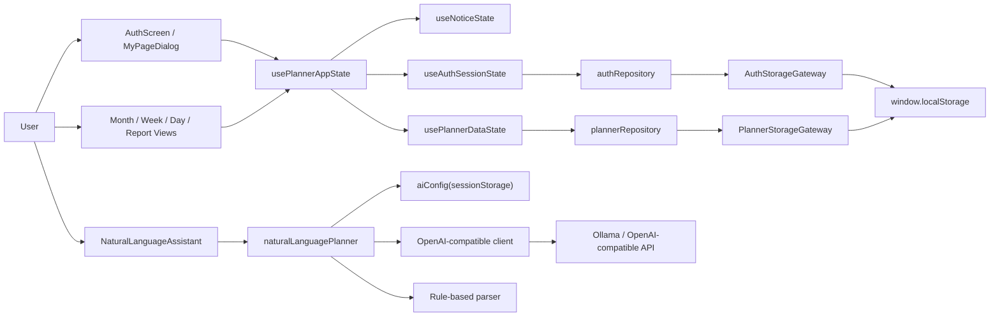
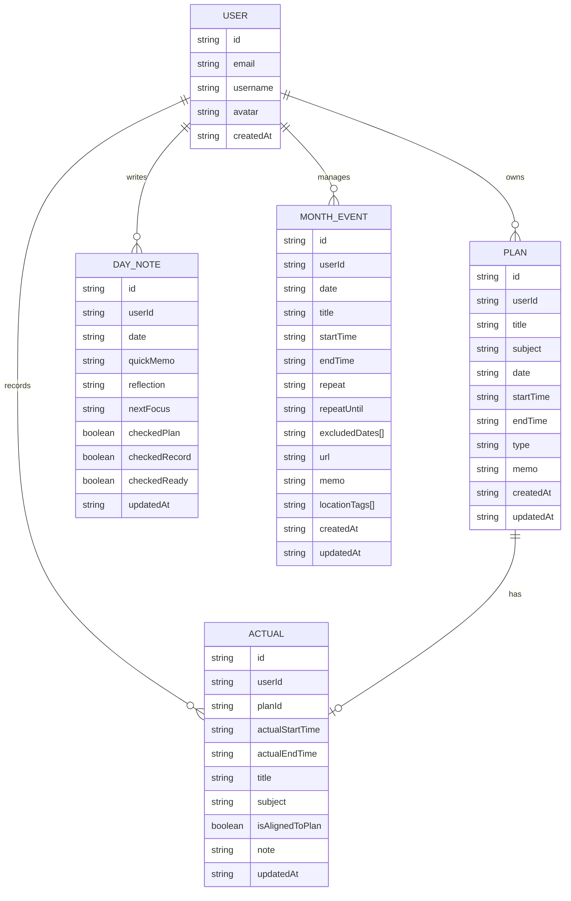

# Architecture Review

## DFD

## ER

## Data Structure Notes

- `Plan` と `Actual` は 1 対 0/1 の構造で、MVP要件の「1予定に対して1実績」を満たしている。
- `MonthEvent` は `Plan` と分離されており、勉強予定と主要予定の責務分離は妥当。
- `MonthEvent` の繰り返しは `repeatUntil` と `excludedDates` で表現していて、削除スコープの拡張余地もある。
- `User` に `username` と `avatar` を持たせたことで、表示用プロフィールは `auth` レイヤーで閉じている。

## Review Summary

- データ構造に致命的な破綻は見つかっていない。
- `usePlannerAppState` の責務は `useAuthSessionState` と `usePlannerDataState` に分割済みで、合成フックとして整理された。
- OpenAI互換APIのキーをブラウザで保持し、ブラウザから直接送る構成は個人ローカル用途には妥協可能だが、公開用途では不適切。
- メール認証はMVP用で、コード表示・セッション保持ともにクライアント完結のため、本番用認証とは別物として扱うべき。

## Checks Run

- `node .\node_modules\typescript\bin\tsc --noEmit`
- `npm run build`
- `npm audit --json`
