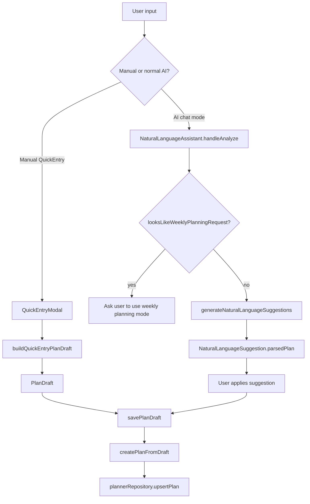
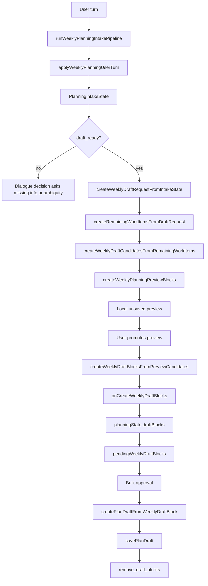

# StudyPlanner Planning Pipelines Overview

This document maps the current scheduling and draft creation flows before adding
"avoid this time/day" behavior. It is based on the implementation as of Phase
9.3a and intentionally does not propose code changes inside this file.

## 1. Overall Shape

StudyPlanner currently has two different planning paths.

- The normal plan path creates or edits `PlanDraft` objects and saves them
  through `savePlanDraft`. It is close to immediate persistence, but natural
  language suggestions still require an explicit user apply action.
- The weekly planning path creates `WeeklyPlanDraftBlock` objects first. These
  blocks are local, reviewable draft blocks. They become normal saved plans only
  when the user runs bulk approval.
- Normal AI input and weekly planning split in
  `src/components/NaturalLanguageAssistant.tsx`. In normal chat mode,
  `handleAnalyze` blocks weekly-looking requests with
  `looksLikeWeeklyPlanningRequest(text)` and asks the user to use weekly
  planning mode. In weekly planning mode, `handleCreateWeeklyDrafts` calls
  `runWeeklyPlanningIntakePipeline`.

There are also two weekly planning generations in the codebase:

- Legacy/availability-aware weekly planning in
  `src/features/weeklyPlanning/weeklyPlanningTransforms.ts`. This path already
  has `availableStudyRanges`, `unavailableRanges`, existing-plan buffers,
  timetable blocking plans, session scoring, and quality preferences.
- New roleplay/intake weekly planning in `src/features/weeklyPlanning/intake/`,
  `pipeline/`, `preview/`, and `scheduling/weeklyDraftCandidateGenerator.ts`.
  This path is deterministic and conversational, but its dry-run generator is
  simpler than the legacy availability-aware generator.

## 2. Normal Plan Creation Pipeline

### Manual quick entry

Manual quick entry lives in `src/components/QuickEntryModal.tsx`.

1. User selects a quick entry mode such as scheduled or repeat.
2. `buildQuickEntryPlanDraft` in `src/lib/quickEntryDrafts.ts` creates a
   `PlanDraft`.
3. `QuickEntryModal` calls `onSavePlan(planDraft)`.
4. In `App.tsx`, `onSavePlan` is `savePlanDraft` from `usePlannerAppState`.
5. `usePlannerDataState.savePlanDraft` validates time order, converts the draft
   with `createPlanFromDraft`, updates local React state optimistically, and
   persists via `plannerRepository.upsertPlan`.

This path saves a normal plan as soon as the user submits the manual form.

### Natural language normal AI input

Normal natural language input is in `NaturalLanguageAssistant`.

1. User enters text in chat mode.
2. `handleAnalyze` first checks `looksLikeWeeklyPlanningRequest(text)`.
   Weekly-looking requests are not sent to the normal suggestion path.
3. `generateNaturalLanguageSuggestions` in
   `src/services/naturalLanguagePlanner.ts` creates
   `NaturalLanguageSuggestion[]`.
4. Internally, the natural language services use a staged parser pipeline in
   `src/services/natural-language/`:
   normalize, tokenize, clause parsing, AST, IR lowering, compile, validate.
   `naturalLanguagePlanner.ts` also keeps existing rules, adapter, allocation,
   and AI-assisted fallback behavior.
5. Suggestions contain `parsedPlan: PlanDraft`.
6. The user applies one suggestion with `handleApplySingle` or all add
   suggestions with `handleApplyAll`.
7. Both apply paths call `onApplyDraft`, which is wired to `savePlanDraft`.

This path is not fully immediate save because the user reviews generated
suggestions first. Once applied, it writes normal plans, not weekly draft blocks.

## 3. Weekly Planning Pipeline

The new conversational weekly planning path is:

```text
userText
-> applyWeeklyPlanningUserTurn / intake reducer
-> PlanningIntakeState
-> createWeeklyDraftRequestFromIntakeState
-> WeeklyDraftRequest
-> createRemainingWorkItemsFromDraftRequest
-> RemainingWorkItem[]
-> createWeeklyDraftCandidatesFromRemainingWorkItems
-> WeeklyDraftCandidate[]
-> createWeeklyPlanningPreviewBlocks
-> local preview
-> createWeeklyDraftBlocksFromPreviewCandidates
-> WeeklyPlanDraftBlock[]
-> onCreateWeeklyDraftBlocks
-> planningState.draftBlocks
-> pendingWeeklyDraftBlocks
-> bulk approval uses createPlanDraftFromWeeklyDraftBlock
-> savePlanDraft
-> remove_draft_blocks
```

Important files:

- `src/features/weeklyPlanning/intake/weeklyPlanningIntakeReducer.ts`
- `src/features/weeklyPlanning/intake/weeklyPlanningDraftRequestAdapter.ts`
- `src/features/weeklyPlanning/intake/weeklyPlanningRemainingWorkItems.ts`
- `src/features/weeklyPlanning/pipeline/weeklyPlanningIntakePipeline.ts`
- `src/features/weeklyPlanning/scheduling/weeklyDraftCandidateGenerator.ts`
- `src/features/weeklyPlanning/preview/weeklyPlanningPreviewBlocks.ts`
- `src/components/NaturalLanguageAssistant.tsx`
- `src/App.tsx`
- `src/features/weeklyPlanning/useWeeklyPlanningState.ts`
- `src/features/weeklyPlanning/weeklyPlanningReducer.ts`
- `src/features/weeklyPlanning/weeklyPlanningStorage.ts`
- `src/features/weeklyPlanning/weeklyPlanningTransforms.ts`

### Weekly planning state handoff

`NaturalLanguageAssistant` owns transient conversation state:

- `weeklyPlanningIntakeState`
- `weeklyPlanningPreviewCandidates`
- `weeklyPlanningPreviewBlocks`
- `weeklyPlanningMessages`

When the user promotes preview to draft, `handlePromoteWeeklyPreviewToDrafts`
calls `createWeeklyDraftBlocksFromPreviewCandidates`, then
`onCreateWeeklyDraftBlocks(blocks)`.

`App.tsx` wires `onCreateWeeklyDraftBlocks` to:

```ts
dispatchPlanningAction({ type: 'add_draft_blocks', blocks })
```

The reducer stores those blocks in `planningState.draftBlocks`. `App.tsx` then
derives:

```ts
planningState.draftBlocks.filter((block) => block.status === 'draft')
```

as `pendingWeeklyDraftBlocks`.

Bulk approval loops over `pendingWeeklyDraftBlocks`, converts each block with
`createPlanDraftFromWeeklyDraftBlock(block, user.id)`, calls `savePlanDraft`,
then dispatches `remove_draft_blocks` for successfully saved block ids.

Weekly planning localStorage is best-effort and stores only pending draft
blocks. `weeklyPlanningStorage.ts` filters to `status === 'draft'` on load and
save.

## 4. Responsibility By Stage

| Stage | Responsibility | Main files |
| --- | --- | --- |
| intake parsing | Interpret user turns into range, exam scope, progress, unit rate, priority, life constraints, fixed events | `intake/weeklyPlanningIntakeReducer.ts`, `weeklyPlanningCompletionParsing.ts`, `weeklyPlanningConstraintParsing.ts`, `weeklyPlanningPriorityParsing.ts`, `weeklyPlanningUnitRateParsing.ts` |
| missing / ambiguity | Keep draft creation blocked until required fields are resolved; preserve field scope ambiguity | `intake/weeklyPlanningMissingStatus.ts`, `dialogue/weeklyPlanningDialogueManager.ts` |
| draft request | Convert only `draft_ready` state into deterministic request; keep `shouldSavePlan: false` | `intake/weeklyPlanningDraftRequestAdapter.ts` |
| remaining work items | Expand year/field units and remove only field-scoped completed years | `intake/weeklyPlanningRemainingWorkItems.ts` |
| session chunking | Split estimated minutes into session chunks | `scheduling/sessionChunking.ts`, used by both weekly paths |
| availability / busy interval | Legacy path builds slots from available ranges, unavailable ranges, existing plans, timetable templates, and buffers. New dry-run path converts intake constraints into busy intervals only. | `scheduling/availabilitySlots.ts`, `weeklyPlanningTransforms.ts`, `scheduling/weeklyDraftCandidateGenerator.ts` |
| placement scoring | Legacy availability-aware path ranks candidate slots by load, preferred dates, quality preferences, and subject sequencing | `scheduling/placementScoring.ts` |
| dry-run candidate generation | New intake path creates unapproved `WeeklyDraftCandidate[]` without saving | `scheduling/weeklyDraftCandidateGenerator.ts` |
| preview display | Map candidates to local `status: 'preview'` blocks for the existing confirmation UI | `preview/weeklyPlanningPreviewBlocks.ts`, `NaturalLanguageAssistant.tsx` |
| draft promotion | Convert preview candidates to unsaved `WeeklyPlanDraftBlock[]` | `preview/weeklyPlanningPreviewBlocks.ts`, `NaturalLanguageAssistant.tsx`, `App.tsx` |
| bulk approval | Convert draft blocks to normal `PlanDraft`, save, and remove draft blocks | `App.tsx`, `weeklyPlanningTransforms.ts`, `usePlannerDataState.ts` |
| discard / delete | Clear all draft blocks or remove an individual block | `weeklyPlanningReducer.ts`, `WeekView.tsx`, `DayView.tsx`, `NaturalLanguageAssistant.tsx` |
| localStorage | Persist only pending weekly draft blocks per user and week start date | `useWeeklyPlanningState.ts`, `weeklyPlanningStorage.ts` |

## 5. Constraint And Availability Handling

| Concept | Type | Generated by | Used by | Hard/soft behavior |
| --- | --- | --- | --- | --- |
| meal | `LifeConstraint.kind = 'meal'` | `weeklyPlanningConstraintParsing.ts` from meal phrases | New dry-run generator as busy interval if time-bounded; adapter keeps it in `constraints` | Hard when explicit time/deadline, otherwise soft/floating |
| bath | `LifeConstraint.kind = 'bath'` | `weeklyPlanningConstraintParsing.ts` | New dry-run generator if `start` or `durationMinutes` can form an interval | Hard when timed, soft/floating when vague |
| sleep | `LifeConstraint.kind = 'sleep'` | `weeklyPlanningConstraintParsing.ts` | New dry-run generator if time-bounded | Hard when timed |
| buffer | `LifeConstraint.kind = 'buffer'` | `weeklyPlanningConstraintParsing.ts` | New dry-run generator only if interval can be derived; otherwise diagnostic trace | Soft/floating unless time-bounded |
| fixed event | `LifeConstraint.kind = 'fixed_event'` | `weeklyPlanningConstraintParsing.ts` | Adapter splits into `fixedEvents`; dry-run generator avoids interval | Hard if confirmed, soft if uncertain |
| unavailable | `LifeConstraint.kind = 'unavailable'` exists in type | Not yet parsed in new intake path | Adapter would place it in `fixedEvents`; dry-run generator treats it as fixed constraint | Intended hard |
| availableStudyRanges | `WeeklyPlanningDefaultConditions.availableStudyRanges` | Legacy default conditions and `weeklyConditionParser.ts` operations | `buildAvailabilitySlots` | Hard outer bounds for legacy weekly placement |
| unavailableRanges | `WeeklyPlanningDefaultConditions.unavailableRanges` | Legacy defaults and condition overrides such as lunch/unavailable ranges | `buildAvailabilitySlots` subtracts them from availability | Hard exclusion in legacy weekly placement |
| existing plan busy interval | `TimeInterval` | `buildPlanBusyIntervalsForDate` from `Plan[]` with buffer | `buildAvailabilitySlots` | Hard exclusion in legacy weekly placement |
| timetable blocking plan | normal `Plan`-shaped blocking item | `createTimetableBlockingPlans` in `weeklyPlanningTransforms.ts` | Legacy availability-aware placement | Hard exclusion through existing-plan busy interval |
| priorityPolicy | `PriorityPolicy` | `weeklyPlanningPriorityParsing.ts` | Remaining work item order; candidate order | Ordering policy, not time availability |
| qualityPreferences | `WeeklyPlanningQualityPreference[]` | `weeklyQualityPreferenceParser.ts` and pending config updater | `placementScoring.ts` | Soft scoring preference in legacy path |
| preferredStudyRanges | `WeeklyPlanningDefaultConditions.preferredStudyRanges` | Legacy defaults and condition parser | `placementScoring.ts` | Soft preference |

The important split is that the legacy weekly path has a general availability
model (`availableStudyRanges` minus `unavailableRanges` minus existing/timetable
busy intervals). The new intake dry-run path currently has a simpler model
(`dayStartTime`/`dayEndTime` plus `LifeConstraint`/`fixedEvents` converted to
busy intervals).

## 6. Duplication Risk Before "Avoid This Time/Day"

The following user instructions should not be implemented as a third scheduling
concept:

- "夕方は使わないで"
- "午前は使わないで"
- "夜は使わないで"
- "14時から16時は使わないで"
- "日曜は空けて"
- "7月3日は使わないで"

Existing places that already overlap:

- `src/features/weeklyPlanning/parsing/weeklyConditionParser.ts` can already
  produce `addUnavailableRange`, `setAvailableRange`, and
  `setAvailableStartTime` for the legacy pending-config path.
- `src/features/weeklyPlanning/config/weeklyPendingConfigUpdater.ts` applies
  those operations to `WeeklyPlanningDefaultConditions.unavailableRanges` and
  `availableStudyRanges`.
- `src/features/weeklyPlanning/scheduling/availabilitySlots.ts` subtracts
  `unavailableRanges` before placement.
- `src/features/weeklyPlanning/scheduling/weeklyDraftCandidateGenerator.ts`
  already avoids `LifeConstraint` intervals, including a future
  `kind: 'unavailable'`.

Candidate generation should not create a candidate first and then hide it later
in preview. That would make diagnostics and remaining work misleading. The
better fit is to convert "do not use" instructions into hard unavailable/busy
intervals before slot search:

- In the legacy path: reuse `WeeklyConditionOperation.addUnavailableRange` and
  `WeeklyPlanningDefaultConditions.unavailableRanges`.
- In the new intake path: parse into `LifeConstraint.kind = 'unavailable'` with
  date/start/end when the instruction is specific enough, then pass it through
  `WeeklyDraftRequest.fixedEvents` to the dry-run generator.

Day-level exclusions need a date-aware representation. Current
`LifeConstraint` can express a day-level block as `date`, `start: '00:00'`,
`end: '24:00'`, `kind: 'unavailable'`, but this should be tested explicitly.
Legacy `unavailableRanges` has no date field, so day-specific exclusions do not
fit that type without either expanding to per-date blocking plans/constraints or
adding a date dimension.

## 7. Type And Function Mapping

| Concept | Type | Generated by | Main functions | Saved in | Hard/soft | Normal plan path | Weekly path | Notes |
| --- | --- | --- | --- | --- | --- | --- | --- | --- |
| Manual plan draft | `PlanDraft` | `buildQuickEntryPlanDraft` | `QuickEntryModal` -> `onSavePlan` | persisted as `Plan` | hard user input | yes | no | Immediate save after submit |
| NL suggestion draft | `NaturalLanguageSuggestion.parsedPlan: PlanDraft` | `generateNaturalLanguageSuggestions` | `handleAnalyze`, `handleApplySingle`, `handleApplyAll` | persisted as `Plan` after apply | reviewable suggestion | yes | no | Weekly-looking text is blocked from normal mode |
| Saved plan | `Plan` | `createPlanFromDraft` | `savePlanDraft` | repository | hard saved event | yes | approval output only | Existing plans block legacy weekly availability |
| Intake state | `PlanningIntakeState` | `applyWeeklyPlanningUserTurn` | `runWeeklyPlanningIntakePipeline` | React state only | mixed | no | yes | Conversation state; not saved as plan |
| Draft request | `WeeklyPlanningDraftRequest` | `createWeeklyDraftRequestFromIntakeState` | pipeline | not persisted | requires `draft_ready` | no | yes | `shouldSavePlan` remains false |
| Remaining work item | `WeeklyPlanningRemainingWorkItem` | `createRemainingWorkItemsFromDraftRequest` | pipeline | not persisted | deterministic work unit | no | yes | Field-scoped completed years only |
| Dry-run candidate | `WeeklyDraftCandidate` | `createWeeklyDraftCandidatesFromRemainingWorkItems` | pipeline | not persisted | unapproved | no | yes | Avoids simple busy intervals |
| Preview block | `WeeklyPlanningPreviewBlock` | `createWeeklyPlanningPreviewBlocks` | `NaturalLanguageAssistant` | component state | unsaved | no | yes | Display-only `status: 'preview'` |
| Weekly draft block | `WeeklyPlanDraftBlock` | `createWeeklyDraftBlocksFromPreviewCandidates`, legacy weekly transforms | `weeklyPlanningReducer` | localStorage pending state | unapproved draft | no | yes | Shown in week/day/assistant confirmation UI |
| Approved weekly plan | `PlanDraft` then `Plan` | `createPlanDraftFromWeeklyDraftBlock` | `approveWeeklyDraftBlocks`, `savePlanDraft` | repository | saved | yes after approval | yes | Draft blocks removed after save |
| Life constraint | `LifeConstraint` | new intake constraint parser | draft request adapter, dry-run generator | intake state only | hard or soft | no | new intake path | Meal/bath/sleep/buffer/fixed/unavailable |
| Legacy unavailable range | `WeeklyPlanningDefaultConditions.unavailableRanges[]` | weekly condition parser/updater | `buildAvailabilitySlots` | pending config | hard | no | legacy weekly path | Time range only, no date field |
| Legacy available range | `WeeklyPlanningDefaultConditions.availableStudyRanges[]` | defaults/updater | `buildAvailabilitySlots` | pending config | hard outer range | no | legacy weekly path | Defines candidate slot envelope |
| Quality preference | `WeeklyPlanningQualityPreference` | `weeklyQualityPreferenceParser.ts` | `placementScoring.ts` | pending config | soft | no | legacy weekly path | Not used by new dry-run candidate generator |

## 8. Data Flow Diagrams

### Normal plan creation



### Conversational weekly planning



## 9. Implemented Scope Through Phase 9.2

Implemented in the new intake path:

- Conversation state model through `PlanningIntakeState`.
- Exam prep scope, year range, field-scoped completed years, unit rate, and
  field-first priority policy.
- Guardrails against fieldless completed years applying to all fields.
- Completion-year revisions after preview, such as adding math 2020 as already
  complete.
- Fixed event additions after preview, with uncertain event wording kept soft.
- Timed life constraint updates after preview, replacing same-kind life
  constraints rather than duplicating them.
- Priority order changes after preview, limited to known fields.
- `WeeklyDraftRequest` creation only when `draft_ready`.
- Remaining work item creation from field/year/unit data.
- Dry-run candidate generation without saving.
- Local preview display using the existing weekly draft confirmation UI.
- Promotion from preview candidates to unsaved `WeeklyPlanDraftBlock` objects.
- Bulk approval path that saves only after explicit user approval.
- `shouldSavePlan: false` preserved across request and diagnostics.

Notably, the pipeline does not auto-save and does not call bulk approval by
itself.

## 10. Unimplemented Or Future Candidates

- Avoid unused time bands or days in the new intake path.
- Prefer math in the morning or other field-specific placement preferences.
- Distribute heavy subjects to reduce fatigue.
- Better fatigue-aware placement scoring in the new dry-run generator.
- Replanning after progress delay.
- More explicit approval-state modeling after draft promotion.
- Connection from saved plans to actual study records.
- ML/RNN/RL support. The useful insertion point is not direct saving; it is
  evaluation and ranking around structured intake/request/work-item/candidate
  data. Deterministic reducers and dry-run diagnostics should remain the
  baseline for comparison.

## 11. Recommended Next Minimal Implementation

For "夕方は使わないで" or "日曜は空けて", avoid adding a separate post-preview
filter. The minimum consistent implementation is:

1. Add parsing in the new intake constraint parser:
   `src/features/weeklyPlanning/intake/weeklyPlanningConstraintParsing.ts`.
2. Represent the result as `LifeConstraint.kind = 'unavailable'`.
   - Time band: `{ kind: 'unavailable', start, end, hardness: 'hard' }`.
   - Date/day band: `{ kind: 'unavailable', date, start: '00:00', end: '24:00',
     hardness: 'hard' }`.
3. Keep ambiguous phrases soft or unconfirmed, following the current fixed event
   pattern.
4. Let `createWeeklyDraftRequestFromIntakeState` route `unavailable` into
   `fixedEvents`, as it already treats `fixed_event` and `unavailable` as fixed
   constraints.
5. Reuse `weeklyDraftCandidateGenerator.constraintToBusyInterval` so slot search
   avoids the interval before candidates are created.
6. Add tests in:
   - `src/features/weeklyPlanning/__tests__/weeklyPlanningIntakeEdgeCases.test.ts`
     for parsing and ambiguity.
   - `src/features/weeklyPlanning/pipeline/weeklyPlanningIntakePipeline.test.ts`
     for preview-stage revision and regeneration.
   - `src/features/weeklyPlanning/scheduling/weeklyDraftCandidateGenerator.test.ts`
     for all-day and time-band unavailable intervals.

For the legacy weekly planning path, the comparable implementation should reuse
`weeklyConditionParser.ts` and `weeklyPendingConfigUpdater.ts`, because that path
already has `addUnavailableRange` and `availableStudyRanges`. Date-specific
unavailable days need a careful design because `WeeklyPlanningDefaultConditions`
currently models unavailable ranges as time-only ranges.

## 12. Practical Notes Before Editing Scheduling

- The normal plan pipeline and the weekly planning pipeline both ultimately call
  `savePlanDraft`, but only the normal path does so directly from user apply or
  manual submit. Weekly planning reaches it only via bulk approval.
- `WeekView`, `DayView`, and `DayTimeline` display `WeeklyPlanDraftBlock[]`;
  they should not be used as the place to enforce constraints.
- The new dry-run generator and the legacy availability-aware generator both use
  `splitDurationIntoSessionChunks`, but they do not share the same slot search
  model.
- The next availability work should decide whether the new intake path should
  remain a small dry-run generator or move closer to the existing
  `buildAvailabilitySlots` / `findBestSlot` model. Duplicating a second
  full-featured availability engine would be the main long-term risk.
